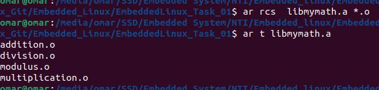
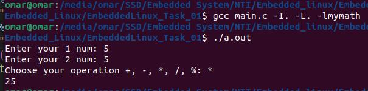

# Embedded Linux

# EmbeddedLinux_Task_01

1. Write Your Code: First, you write the source code for the functions you want to include in your library.
2. Compile Your Code: Compile the source code files (.c files) into object files (.o files). For example, if you have mymath.c, you would compile it like this:
   gcc -c operation.c -o operation.o
3. Create the Archive: Use the ar command to create the static library archive:
   - **ar rcs libmymath.a mymath.o**
   - r: Insert the files into the archive (replace existing files).
   - c: Create the archive if it does not already exist.
   - s: Write an index into the archive, which allows quick access to the individual object files within the archive.
5. Verify: You can verify that the library has been created successfully using the ar command:
   - **"ar t libmymath.a"**
   - This command lists the contents of the archive.
7. Link Your Program: To use the static library in your programs, you need to link them with it. You can do this by including the library when compiling your program:
   - **"gcc your_program.c -o your_program -L/path/to/library -lmymath"**
   - -L: Specifies the directory where the library (libmymath.a) is located.
   - -lmymath: Links your program with libmymath.a.

